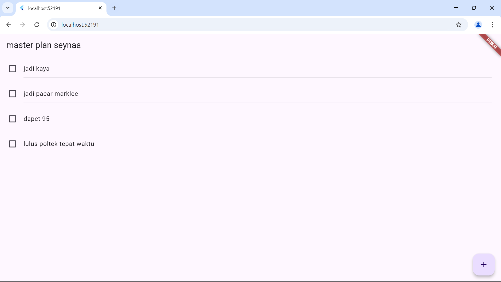
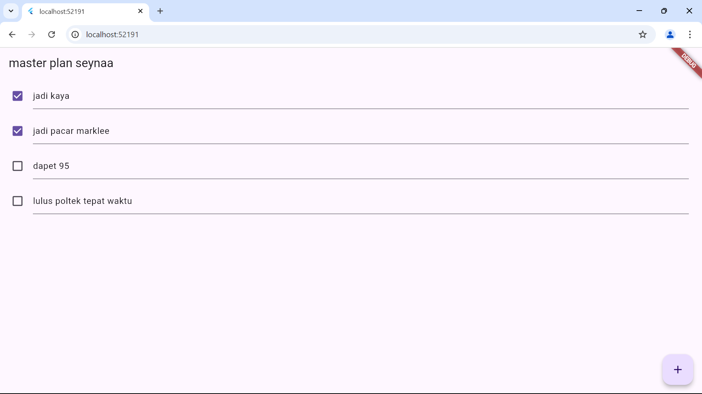
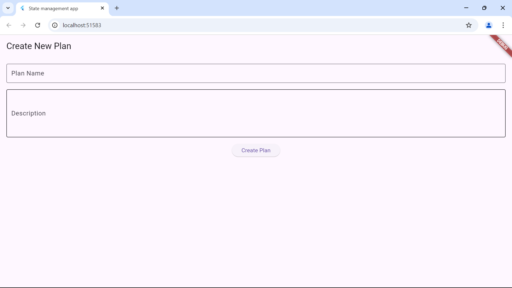

# master_plan1
PRAKTIKUM 1

- Jelaskan maksud dari langkah 4 pada praktikum tersebut! Mengapa dilakukan demikian?

Tujuan langkah 4 adalah untuk meringkas dan merapihkian proses impor model .Dengan membuat data_layaer.dart kita cuma memerlukan satu kali impor untuk akses model dari plan.dart dan task.dart.Langkah ini bermanfaat, terutama untuk membuat kode yang lebih mudah digunakan dan rapi. Dengan menyatukan semua impor model dalam satu file data_layer.dart, kita tidak perlu mengirimkan masing-masing model ke berbagai file,cukup impor data_layer.dart, dan kita dapat mengakses semua model yang kita butuhkan.

-Mengapa perlu variabel plan di langkah 6 pada praktikum tersebut? Mengapa dibuat konstanta ?

Variabel plan penting karena jadi tempat meyimpan data yang akan digunakan untuk mengelola plan.Kenapa di buat konstanta?Karena ingin mendeklarasikan plan sebagai objek yang nilai awalnya tidak berubah

Ouputnya adalah dimana setiap tugas bisa diubah statusya selesai atau belum dan deskripsinya

Apa kegunaan method pada Langkah 11 dan 13 dalam lifecyle state ?

Pada langkah 11 dan 13 kita menambahkan dua method inistate() dan dispose().inistate() berguna untuk inisialisasi awal ,dan dispose() memastikan resource scrollController dibbersihkan.

Kode ini membuat tampilan dengan judul "Master Plan Aditya" dan daftar tugas yang bisa dicentang. ValueListenableBuilder memantau perubahan pada data Plan dan memperbarui tampilan otomatis. Di bagian bawah, ada pesan progres dan tombol + untuk menambah tugas baru.

PRAKTIKUM 3

Berdasarkan Praktikum 3 yang telah Anda lakukan, jelaskan maksud dari gambar diagram berikut ini!

Diagram ini menunjukkan perubahan struktur widget pada aplikasi Flutter setelah melakukan navigasi dengan Navigator.push. Di struktur awal (sebelah kiri), aplikasi dimulai dari MaterialApp yang berisi PlanProvider dan PlanCreatorScreen. Di dalam layar tersebut, ada susunan widget Column yang berisi TextField dan Expanded dengan ListView sebagai anaknya. Setelah navigasi (sebelah kanan), aplikasi berpindah ke PlanScreen yang menggunakan Scaffold sebagai pembungkus utama. Di dalamnya, ada Column yang berisi Expanded dengan ListView dan SafeArea untuk menjaga agar teks tidak terpotong di area sensitif layar (seperti notch). Diagram ini intinya memperlihatkan bagaimana struktur tampilan berubah setelah navigasi.

